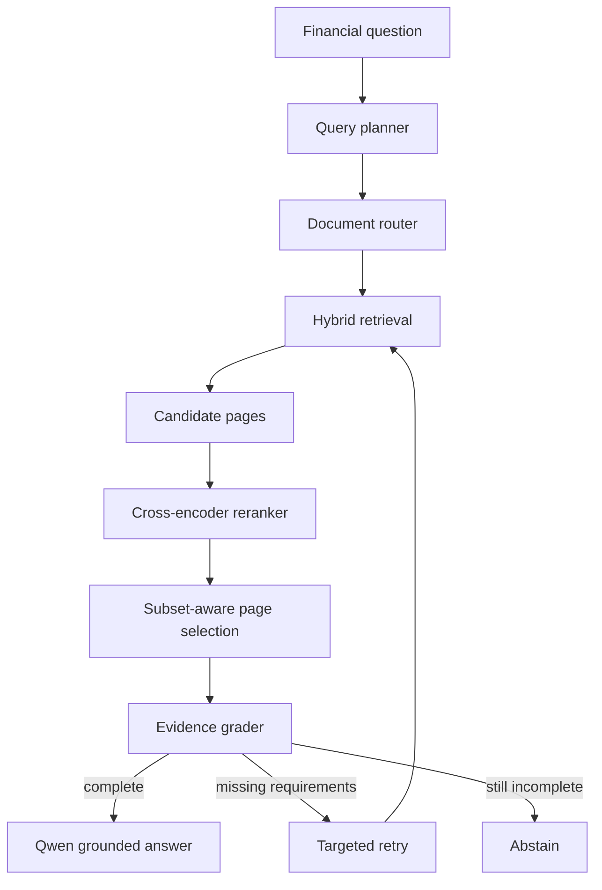

# FinRoute: Evidence-Aware Agentic RAG for Financial Filings

FinRoute is a modular retrieval-augmented generation system for answering questions over long financial filings. It combines document routing, hierarchical page retrieval, table-aware search, cross-encoder reranking, evidence completeness checks, a controlled retry loop, and citation-grounded Qwen generation.

The repository is designed as an auditable research/engineering project: retrieval and generation are separated, every workflow step emits a trace, and evaluation code is included without publishing experiment outputs or private artifacts.

## System architecture



## Core design

- **Hierarchical filing index:** page, parent, child, and table-block representations retain document, page, section, form, company, fiscal year, and statement metadata.
- **Hybrid retrieval:** BGE dense retrieval and BM25 lexical retrieval are fused with reciprocal rank fusion (RRF). Chroma provides persistent vector storage and metadata filtering.
- **Document routing:** company aliases, filing metadata, exact company/year signals, and semantic/lexical scores identify the top routed filings before page search.
- **Rule-based query planning:** financial metric, year, operands, required terms, statement types, subqueries, and numeric/multi-page requirements determine the narrative, table, calculation, or mixed path.
- **Table-first candidate generation:** structured table blocks are prioritized for numerical questions while narrative child/page fallback preserves disclosures outside tables. Source and document quotas prevent one path or filing from occupying the entire shortlist.
- **Query-centered reranking:** the BGE cross-encoder scores the most relevant excerpts instead of truncating each page from the beginning. Final scores blend reranker relevance, hybrid retrieval evidence, and structural signals.
- **Soft multi-page selection:** pages are selected jointly with bonuses for new operands, statement types, and years, improving complementary evidence coverage.
- **Evidence-aware workflow:** a LangGraph state machine checks operand, year, term, numeric-anchor, and requirement coverage; incomplete evidence triggers one targeted retrieval retry before safe abstention.
- **Grounded generation:** Qwen receives only selected filing evidence, returns structured JSON, uses page-level citations, and exposes a restricted arithmetic evaluator for derived metrics.

## Repository layout

```text
finroute/
├── configs/default.yaml
├── data/README.md
├── scripts/run_finroute.py
├── src/finroute/
│   ├── build.py
│   ├── cli.py
│   ├── config.py
│   ├── evaluation.py
│   ├── generation.py
│   ├── grading.py
│   ├── indexing.py
│   ├── pipeline.py
│   ├── planning.py
│   ├── preprocessing.py
│   ├── reranking.py
│   ├── retrieval.py
│   ├── routing.py
│   ├── schemas.py
│   └── workflow.py
└── tests/
```

## Installation

Python 3.10+ and a CUDA-capable GPU are recommended for reranking and local generation.

```bash
git clone https://github.com/<your-account>/finroute.git
cd finroute
python -m venv .venv
source .venv/bin/activate  # Windows: .venv\Scripts\activate
pip install -e .
```

Copy the environment template and set local model paths when the machine cannot access Hugging Face:

```bash
cp .env.example .env
```

## Docker

FinRoute ships as a portable, CPU-only image (Python 3.11 with CPU PyTorch wheels). The image entrypoint is the `finroute` CLI, and all state — PDFs, index artifacts, Hugging Face model cache — lives in mounted volumes, so nothing is baked into the image.

Build it locally:

```bash
docker build -t finroute:local .
```

CI also publishes the image to GHCR on every push to `main` and on version tags:

```bash
docker pull ghcr.io/<owner>/finroute  # image name follows the repository name
```

### Build the index and ask questions

```bash
# Build the index from your local data/ directory
docker run --rm -u "$(id -u):$(id -g)" \
  -v "$PWD/data:/app/data" -v "$PWD/artifacts:/app/artifacts" -v finroute_hf_cache:/app/hf_cache \
  finroute:local build-index \
  --pdf-dir data/pdfs --metadata data/documents.csv --artifacts artifacts

# Retrieval-only answer (JSON with plan, routed documents, pages, grade, trace)
docker run --rm -u "$(id -u):$(id -g)" \
  -v "$PWD/artifacts:/app/artifacts" -v finroute_hf_cache:/app/hf_cache \
  finroute:local ask \
  --artifacts artifacts --question "What was the company's operating margin in 2023?"

# Add --generate to load the configured Qwen model and produce a grounded answer
```

Notes:

- `-u "$(id -u):$(id -g)"` keeps files written to `./artifacts` owned by your user instead of root. On Windows (PowerShell) omit it and use `${PWD}` for bind paths.
- The named `finroute_hf_cache` volume persists Hugging Face weights so models download only once.
- Override any `FINROUTE_*` variable with `--env-file .env` or `-e FINROUTE_HF_LOCAL_ONLY=1` (see `.env.example`).

### docker compose

`docker-compose.yml` wires up the same volumes and loads `.env` when present:

```bash
docker compose run --rm finroute build-index \
  --pdf-dir data/pdfs --metadata data/documents.csv --artifacts artifacts

docker compose run --rm finroute ask \
  --artifacts artifacts --question "..." --generate
```

### CPU vs. GPU

The image uses CPU PyTorch wheels to stay portable and small; retrieval, reranking, and generation all run on CPU (generation is slower). For heavy local generation on a GPU, either run the project natively (see Installation) or set `FINROUTE_GENERATOR_BACKEND=openai_compatible` and point `FINROUTE_GENERATOR_BASE_URL` at a vLLM/SGLang server serving the same model.

## Prepare data

Financial PDFs and benchmark answers can be downloaded from [Financebench Dataset](https://github.com/patronus-ai/financebench/tree/main). Place PDFs under `data/pdfs/` and create `data/documents.csv` with:

```csv
doc_name,file_name,company,year,form
example_2023_10k,example.pdf,Example Corp,2023,10-K
```

> **No filings handy?** [examples/README.md](examples/README.md) generates a tiny
> synthetic dataset (fictional 10-Ks, metadata, and gold labels) and runs the entire
> workflow — index build, ask, evaluate — natively or inside Docker.

Build the page/chunk/table corpora, embeddings, BM25 state, and persistent Chroma collections:

```bash
python -m finroute.cli build-index \
  --pdf-dir data/pdfs \
  --metadata data/documents.csv \
  --artifacts artifacts \
  --config configs/default.yaml
```

## Ask a question

```bash
python -m finroute.cli ask \
  --artifacts artifacts \
  --config configs/default.yaml \
  --question "What was the company's operating margin in 2023?"
```

Add `--generate` to load the configured Qwen model and produce a grounded answer. Without it, the command returns the plan, routed documents, selected pages, evidence grade, abstention decision, and complete LangGraph trace.

## Evaluate retrieval

Prepare a JSONL file with `question`, `doc_name`, and `evidence` fields. Each `evidence` entry must contain `evidence_page_num` (zero-based benchmark page index) and may contain `doc_name`.

```bash
python -m finroute.cli evaluate \
  --artifacts artifacts \
  --questions data/evaluation.jsonl \
  --output artifacts/evaluation.jsonl \
  --config configs/default.yaml
```

The evaluation module implements document Recall@K, page Hit@K, Recall@K, Precision@K, All-Gold@K, MRR@K, nDCG@K, evidence-window F1, latency summaries, and bootstrap confidence intervals. No experiment result files are included in this repository.

## Tests

```bash
pip install -e ".[dev]"
pytest
```

Unit tests cover query planning, retrieval metrics, evidence grading, and calculator safety without downloading large models.

## Reproducibility and safety

- Gold document/page/evidence labels are accepted only by the offline evaluation module and are not available to the planner, router, retriever, grader, or generator.
- Model IDs, thresholds, fusion weights, and shortlist sizes live in `configs/default.yaml`.
- Cached corpora, embeddings, Chroma databases, PDFs, model weights, prompts containing proprietary data, and evaluation outputs are excluded by `.gitignore`.
- The generator is instructed to use retrieved evidence only. If the grader remains incomplete after one retry, the workflow abstains instead of forcing an answer.

## Data and model licenses

This code does not redistribute FinanceBench, SEC filings, BGE, Qwen, or any model weights. Download each resource from its official source and follow its license and usage terms.

## License

MIT License. See [LICENSE](LICENSE).
